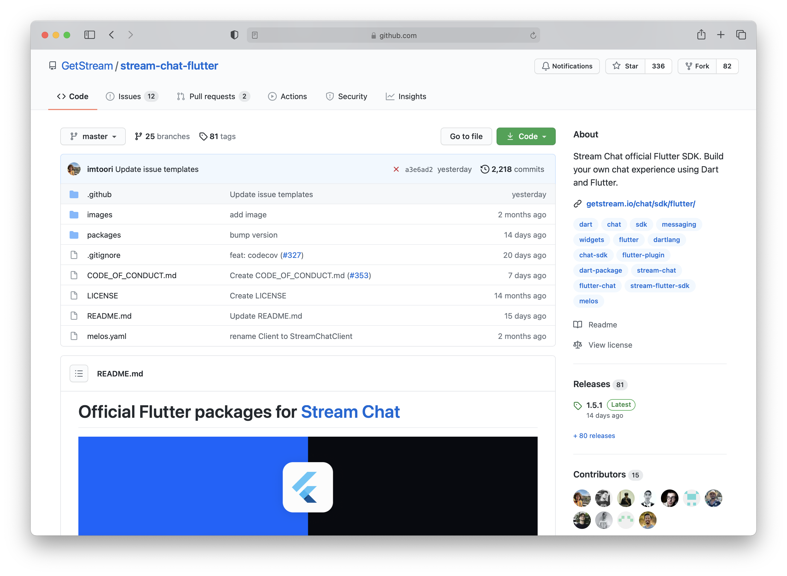
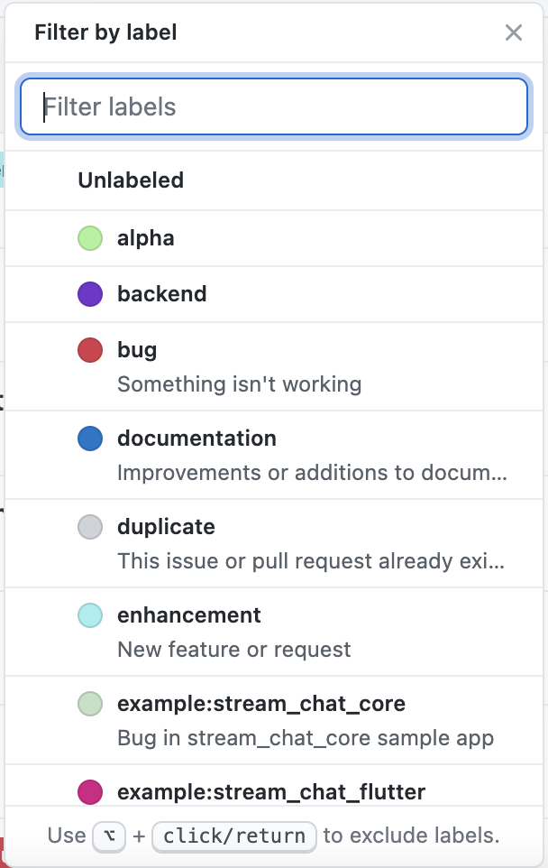
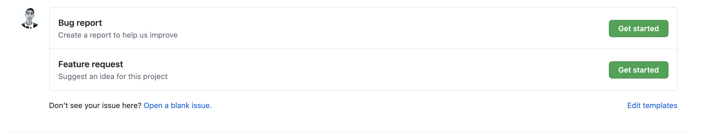
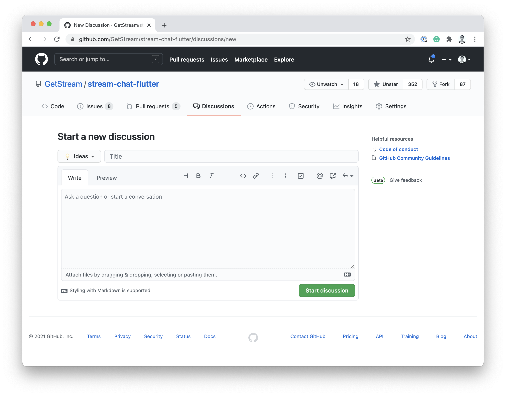
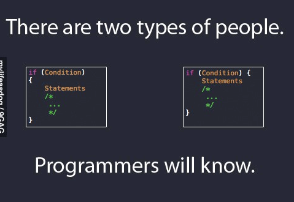

# Stream's Contribution Guide

Welcome to Stream’s Flutter repository! Thank you for taking the time to contribute to our codebase 🎉.

This document outlines a set of guidelines for contributing to Stream and our packages. These are mostly guidelines, not a fixed set of rules. Please use your best judgment and feel free to propose changes to this document in a pull request.

**Table of Contents** 

---

# I have a question, do I need to read this? 💬

Probably not, most questions can be answered by looking at our Frequently Asked Questions (FAQ) or Flutter Cookbook. In most cases, answers to common questions can be found under these pages. 

If you are still having doubts around a specific API, please create an issue on your repository with the label "Question". Community members or team members would be happy to assist. 

In cases where you suspect the issue may be a defect or bug, please use one of our pre-made templates when filing an issue. Be sure to include as many details as possible to help our team reproduce the error. A good bug report should have clear and consistent instructions for reproducing, screenshots or videos of the bug if applicable, and information on your environment setup and flutter version.

You can include the output of `flutter doctor --verbose` when filing an issue.

🔗: [https://github.com/GetStream/stream-feed-flutter/issue](https://github.com/GetStream/stream-feed-flutter/issues)

---

# What should I know before diving into code? 🤔

Stream's Flutter code is kept in a single mono-repository consisting of multiple packages. Source code for each package can be found under the top-level  `/packages` directory. 



### Project Structure 🧱

`.github` - GitHub files including issue templates, pull request templates and Github Action scripts.

`images` - Static images used in our README and elsewhere. 

`package` - Directory containing Stream's Flutter source code. Each sub-directory represents a Flutter (or Dart) project. 

`.gitignore` - Listing of files and file extension ignored for this project.

`CODE_OF_CONDUCT` - Our values, approach to writing code and expectations for Stream developers and contributors. 

`LICENSE` - Legal, did we mention legal yet?

`README` - Project overview

`melos.yaml` - Configuration file used to control [Melos](https://pub.dev/packages/melos), our mono-repo management tool of choice. 

### Current Stream Packages

`stream_feed` - Stream Feed is a low level wrapper around Stream's REST API and web-sockets. It contains minimal external dependencies and does not rely on Flutter. It is possible to use this package on most platforms supported by Dart. 

`faye_dart` - Faye is client for the publish/subscribe messaging protocol that is built on the Bayeux protocol, a messaging system utilized for transporting asynchronous messages over HTTP.

### Local Setup

Congratulations 🎉.  You've successfully cloned our repo, and you are ready to make your first contribution. Before you can start making code changes, there are a few things developers should configure. 

**Melos Setup**

Stream uses melos to manage our mono-repository. For those unfamiliar, Melos is used to  split up large code bases into separate independently versioned packages. To install melos, developers can run the following command:

```bash
pub global activate melos 
```

Once activated, users can now "bootstrap" their local clone by running the following:

```bash
melos bootstrap
```

Bootstrap will automatically fetch and link dependencies for all packages in the repo. It is the melos equivalent of running `flutter pub get`.

Bonus Tip: Did you know it is possible to define and run custom scripts using Melos? Our team uses custom scripts for all sorts of actions like testing, lints, and many more. 

To run a script, use `melos run <script name>`

---

# How can I contribute?

Are you ready to dive into code? It is effortless to get up and running with your first Stream contribution. If this is your first time sending a PR to stream, please read our section on [local setup]() before continuing. 

## Filing bugs 🐛

Before filing bugs, take a look at our existing backlog. For common bugs, there might be an existing ticket on GitHub. 

To quickly narrow down the amount of tickets on Github, try filtering based on the label that best suites our bug.



Didn't find an existing issue? That's okay, you can file a new bug using one of our pre-made issue templates. 



Make sure to provide as much information as possible when filing bug reports. A good issue should have steps to reproduce, information on your development environment and expected behavior. 

Screenshots and gifs are always welcomed :)

## Feature Request 💡

Have an idea for a new feature? We would love to hear about it! 

Our team uses GitHub discussions to triage and discuss feature requests. Before opening a new topic, please check our existing issues and pull requests to ensure the feature you are suggesting is not already in progress. 

To file a feature request, select the "Discussions" tab on our GitHub repo or [visit this link](https://github.com/GetStream/stream-feed-flutter/discussions/new). Once there, change the default category to "**💡 Ideas**", then write a brief description of your feature/change.

Screenshots, sketches and sample code are all welcomed!



Here are some common questions you can answer when filing a feature request:

**Is your feature request related to a problem? Please describe.**
A clear and concise description of what the problem is. Ex. I'm always frustrated when [...]

**Describe the solution you'd like**
A clear and concise description of what you want to happen.

**Describe alternatives you've considered**
A clear and concise description of any alternative solutions or features you've considered.

**Additional context**
Add any other context or screenshots about the feature request here.

## Pull Request 🎉


Thank you for taking the time to submit a patch and contribute to our codebase, you rock!  

Before we can land your pull request, please don't forget to [sign Stream's CLA (Contributor License Agreement](https://docs.google.com/forms/d/e/1FAIpQLScFKsKkAJI7mhCr7K9rEIOpqIDThrWxuvxnwUq2XkHyG154vQ/viewform) 📝

### PR Semantics 🦄

Our team uses [Conventional Commits](https://www.conventionalcommits.org/en/v1.0.0/) when coding and creating PRs. Using this standard makes it easy for our team to review and identify commits in our repo quickly. 

While we don't expect developers to follow the specification down to every commit message, we enforce semantics on PR titles. 

PR titles should follow the format below:

```jsx
<type>[optional scope]: <description>

[optional body]

[optional footer(s)]
```

1. **fix:** a commit of the *type* `fix` patches a bug in your codebase (this correlates with **`[PATCH](http://semver.org/#summary)`** in Semantic Versioning).
2. **feat:** a commit of the *type* `feat` introduces a new feature to the codebase (this correlates with **`[MINOR](http://semver.org/#summary)`** in Semantic Versioning).
3. **BREAKING CHANGE:** a commit that has a footer `BREAKING CHANGE:`, or appends a `!` after the type/scope, introduces a breaking API change (correlating with **`[MAJOR](http://semver.org/#summary)`** in Semantic Versioning). A BREAKING CHANGE can be part of commits of any *type*.
4. *types* other than `fix:` and `feat:` are allowed, for example **[@commitlint/config-conventional](https://github.com/conventional-changelog/commitlint/tree/master/%40commitlint/config-conventional)** (based on the **[the Angular convention](https://github.com/angular/angular/blob/22b96b9/CONTRIBUTING.md#-commit-message-guidelines)**) recommends `build:`, `chore:`, `ci:`, `docs:`, `style:`, `refactor:`, `perf:`, `test:`, and others.
5. *footers* other than `BREAKING CHANGE: <description>` may be provided and follow a convention similar to **[git trailer format](https://git-scm.com/docs/git-interpret-trailers)**.

### Testing

At Stream, we value testing. Every PR should include a passing tests for existing and new features. To run our test suite locally, developers can use the following melos command:

```bash
> melos run test:dart
> melos run test:flutter
```

### Our Process

By default, our development branch is `develop`. Developers should create new PRs from and target development when working on new features. 

Develop is merged into master after the team performs various automated and QA tests on the branch. Master, can be considered our stable branch, it represents the latest published release on pub.dev. 

---

# Styleguides 💅



We use style guides and lint checks to keep our code consistent and maintain best practices. Our team uses Dart's built-in analyzer for linting and enforcing code styles. The full list of analyzer rules can be found below.

## Dart lint rules 📖

```jsx
include: package:pedantic/analysis_options.yaml

analyzer:
  enable-experiment:
    - extension-methods
  exclude:
    - lib/**/*.g.dart
    - example/**

linter:
  rules:
    - avoid_empty_else
    - avoid_init_to_null
    - avoid_return_types_on_setters
    - avoid_web_libraries_in_flutter
    - await_only_futures
    - camel_case_types
    - cancel_subscriptions
    - close_sinks
    - control_flow_in_finally
    - empty_constructor_bodies
    - empty_statements
    - hash_and_equals
    - implementation_imports
    - library_names
    - non_constant_identifier_names
    - package_names
    - package_prefixed_library_names
    - prefer_is_not_empty
    - public_member_api_docs
    - slash_for_doc_comments
    - sort_constructors_first
    - sort_unnamed_constructors_first
    - test_types_in_equals
    - throw_in_finally
    - type_init_formals
    - unnecessary_brace_in_string_interps
    - unnecessary_getters_setters
    - unnecessary_statements
    - unrelated_type_equality_checks
    - valid_regexps
```