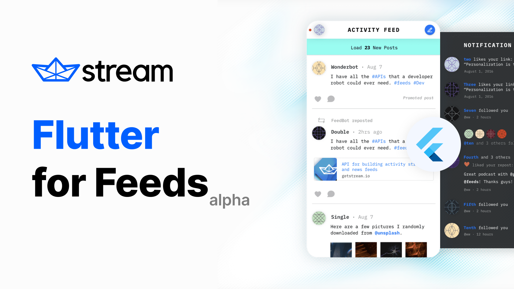

# Official Flutter packages for [Stream Activity Feeds](https://getstream.io/activity-feeds/?=utm_medium=stream_github&utm_source=flutter_feeds)

>The official Dart client for Stream Activity Feeds, a service for building activity feed applications. This library can be used on any Dart project and on both mobile and web apps with Flutter. You can sign up for a Stream account at https://getstream.io/get_started.

<p align="center">
 <a href="https://pub.dartlang.org/packages/stream_feed"></a>
  <a href="https://github.com/GetStream/stream-feed-flutter/actions?query=workflow%Build"></a>
  <a href="https://codecov.io/gh/GetStream/stream-feed-flutter"></a>
   <a href="https://github.com/invertase/melos"></a>
</p>
<p align="center">

</p>

**🔗 Quick Links**

- [Register](https://getstream.io/activity-feeds/trial/) to get an API key for Stream Activity Feeds
- [Stream Activity Feeds UI Kit](https://getstream.io/activity-feeds/ui-kit/)

## 🛠 Installation

#### Install from pub

Next step is to add `stream_feed` to your dependencies, to do that just open pubspec.yaml and add it inside the dependencies section.

```yaml
dependencies:
  flutter:
    sdk: flutter

  stream_feed: ^0.0.1
```
#### Using with Flutter

This package can be integrated into Flutter applications. Remember to not expose the App Secret in your Flutter web apps, mobile apps, or other non-trusted environments like desktop apps.

## 🔌 Usage

### API client setup Serverside + Clientside

If you want to use the API client directly on your web/mobile app you need to generate a user token server-side and pass it.

#### Server-side token generation

```dart

// Instantiate a new client (server side)
const apiKey = 'my-API-key';
const secret = 'my-API-secret';

// Instantiate a new client (server side)
var client = StreamClient.connect(apiKey, secret: secret);

// Optionally supply the app identifier and an options object specifying the data center to use and timeout for requests (15s)
client = StreamClient.connect(apiKey,
      secret: secret,
      appId: 'yourappid',
      options: StreamHttpClientOptions(
          location: Location.usEast, connectTimeout: Duration(seconds: 15)));

// Create a token for user with id "the-user-id"
final userToken = client.frontendToken('the-user-id');
```

> :warning: for security, you must never expose your API secret or generated client side token, and it's highly recommended to use `exp` claim in client side token.


#### Client API init

```dart
// Instantiate new client with a user token
var client = StreamClient.connect(apiKey, token: Token('userToken'));
```

### 🔮 Examples

```dart
// Instantiate a feed object server side
var user1 = client.flatFeed('user', '1');

// Get activities from 5 to 10 (slow pagination)
final activities = await user1.getActivities(limit: 5, offset: 5);
// Filter on an id less than a given UUID
final filtered_activities = await user1.getActivities(
      limit: 5,
      filter: Filter().idLessThan('e561de8f-00f1-11e4-b400-0cc47a024be0')

// All API calls are performed asynchronous and return a Promise object
await user1
    .getActivities(
        limit: 5,
        filter: Filter().idLessThan('e561de8f-00f1-11e4-b400-0cc47a024be0'))
    .then((value) => /* on success */
        print(value))
    .onError((error,
              stackTrace) => /* on failure, reason.error contains an explanation */
        print(error));

// Create a new activity
final activity = Activity( actor: '1', verb: 'tweet', object: '1', foreignId: 'tweet:1' );
final added_activity = await user1.addActivity(activity);
// Create a bit more complex activity
final complex_activity = Activity(
    actor: '1',
    verb: 'run',
    object: '1',
    foreignId: 'run:1',
    extraData: {
      'course': {'name': 'Golden Gate park', 'distance': 10},
      'participants': ['Thierry', 'Tommaso'],
      'started_at': DateTime.now().toIso8601String(),
    },
  );
final added_complex_activity = await user1.addActivity(complex_activity);

// Remove an activity by its id
await user1.removeActivityById('e561de8f-00f1-11e4-b400-0cc47a024be0');
// or remove by the foreign id
await user1.removeActivityByForeignId('tweet:1');

// mark a notification feed as read
await notification1.getActivities(
  marker: ActivityMarker().allRead(),
);


// mark a notification feed as seen
await notification1.getActivities(
  marker: ActivityMarker().allSeen(),
);

// Follow another feed
await user1.follow(client.flatFeed('flat', '42'));

// Stop following another feed
await user1.unfollow(client.flatFeed('flat', '42'));

// Stop following another feed while keeping previously published activities
// from that feed
await user1.unfollow(client.flatFeed('flat', '42'), keepHistory: true);

// Follow another feed without copying the history
await user1.follow(client.flatFeed('flat', '42'), activityCopyLimit: 0);

// List followers, following
await user1.getFollowers(limit: 10, offset: 10);
await user1.getFollowed(limit: 10, offset: 0);


await user1.follow(client.flatFeed('flat', '42'));

// adding multiple activities
const activities = [
  Activity(actor: '1', verb: 'tweet', object: '1'),
  Activity(actor: '2', verb: 'tweet', object: '3'),
];
await user1.addActivities(activities);

// specifying additional feeds to push the activity to using the to param
// especially useful for notification style feeds
final to = FeedId.fromIds(['user:2', 'user:3']);
final activityTo = Activity(
  to: to,
  actor: '1',
  verb: 'tweet',
  object: '1',
  foreignId: 'tweet:1',
);
await user1.addActivity(activityTo);


// adding one activity to multiple feeds
final feeds = FeedId.fromIds(['flat:1', 'flat:2', 'flat:3', 'flat:4']);
final activityTarget = Activity(
  actor: 'User:2',
  verb: 'pin',
  object: 'Place:42',
  target: 'Board:1',
);

// ⚠️ server-side only!
await client.batch.addToMany(activityTarget, feeds!);

// Batch create follow relations (let flat:1 follow user:1, user:2 and user:3 feeds in one single request)
const follows = [
  Follow('flat:1', 'user:1'),
  Follow('flat:1', 'user:2'),
  Follow('flat:1', 'user:3'),
];

// ⚠️ server-side only!
await client.batch.followMany(follows);

// Updating parts of an activity
final set = {
  'product.price': 19.99,
  shares: {
    facebook: '...',
    twitter: '...',
  },
};
final unset = ['daily_likes', 'popularity'];

// ...by ID
final update = ActivityUpdate.withId( '54a60c1e-4ee3-494b-a1e3-50c06acb5ed4', set, unset);
await client.updateActivityById(update);
// ...or by combination of foreign ID and time
const timestamp = DateTime.now();
const foreignID= 'product:123';
final update2 = ActivityUpdate.withForeignId(
  foreignID,
  timestamp,
  set,
  unset,
);
await client.updateActivityById(update2);


// update the 'to' fields on an existing activity
// client.flatFeed("user", "ken").function (foreign_id, timestamp, new_targets, added_targets, removed_targets)
// new_targets, added_targets, and removed_targets are all arrays of feed IDs
// either provide only the `new_targets` parameter (will replace all targets on the activity),
// OR provide the added_targets and removed_targets parameters
// NOTE - the updateActivityToTargets method is not intended to be used in a browser environment.
await client.flatFeed('user', 'ken').updateActivityToTargets('foreign_id:1234', timestamp, ['feed:1234']);
await client.flatFeed('user', 'ken').updateActivityToTargets('foreign_id:1234', timestamp, null, ['feed:1234']);
await client.flatFeed('user', 'ken').updateActivityToTargets('foreign_id:1234', timestamp, null, null, ['feed:1234']);
```

### Realtime (Faye)

Stream uses [Faye](http://faye.jcoglan.com) for realtime notifications. Below is quick guide to subscribing to feed changes

```dart

// ⚠️ userToken is generated server-side (see previous section)
final client = StreamClient.connect('YOUR_API_KEY', token: userToken,appId: 'APP_ID');
final user1 = client.flatFeed('user', '1');

// subscribe to the changes
final subscription = await userFeed.subscribe((message) => print(message));
// now whenever something changes to the feed user 1
// the callback will be called

// To cancel a subscription you can call cancel on the
// object returned from a subscribe call.
// This will remove the listener from this channel.
await subscription.cancel();
```

Docs are available on [GetStream.io](http://getstream.io/docs/?language=dart).

## Free for Makers

Stream is free for most side and hobby projects. To qualify your project/company needs to have < 5 team members and < $10k in monthly revenue.
For complete pricing details visit our [Feed Pricing Page](https://getstream.io/activity-feeds/pricing/)

## Structure
Stream Feed Dart is a monorepo built using [Melos](https://docs.page/invertase/melos). Individual packages can be found in the `packages` directory while configuration and top level commands can be found in `melos.yaml`.

To get started, run `bootstrap` after cloning the project.

```shell
melos bootstrap
```

### Dart version requirements

This API Client project requires Dart v2.12 at a minimum.

See the [github action configuration](.github/workflows/build.yaml) for details of how it is built, tested and packaged.

## Contributing

See extensive at [test documentation](test/README.md) for your changes.

You can find generic API documentation enriched by code snippets from this package at http://getstream.io/docs/?language=dart

## Copyright and License Information

Project is licensed under the [BSD 3-Clause](LICENSE).

## We are hiring

We've recently closed a [\$38 million Series B funding round](https://techcrunch.com/2021/03/04/stream-raises-38m-as-its-chat-and-activity-feed-apis-power-communications-for-1b-users/) and we keep actively growing.
Our APIs are used by more than a billion end-users, and you'll have a chance to make a huge impact on the product within a team of the strongest engineers all over the world.

Check out our current openings and apply via [Stream's website](https://getstream.io/team/#jobs).
